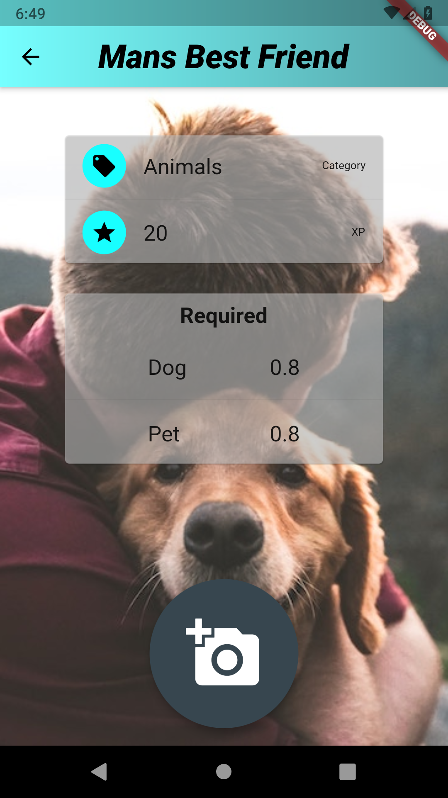

# SnapBounty

[](https://codemagic.io/apps/5cce565044381500175b547e/5cce565044381500175b547d/latest_build)

Flutter Application utilizing Google Firebase as the backend datastore and MLkits image labelling API.

  

## Download

[](https://play.google.com/store/apps/details?id=com.cbeardsmore.snapbounty)

## Build and Run

- Install [Flutter](https://flutter.dev/docs/get-started/install) and confirm installation:
	
	```bash
	flutter doctor
	```

- Build the APK:

	```bash
	flutter build apk
	```

- Build the Android App Bundle

	```bash
	flutter build appbundle
	```

- Run the app:

	```
	flutter run
	```
